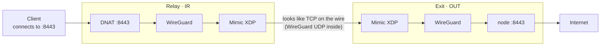

<div align="center">

# AZHDAR

**A WireGuard tunnel that travels as TCP**

**تانل وایرگاردی که به‌شکل TCP سفر می‌کند**


</div>

AZHDAR builds and maintains a WireGuard link between a relay server and an exit
server, and uses [Mimic](https://github.com/hack3ric/mimic) (eBPF/XDP) to make the
UDP traffic look like an ordinary TCP session on the wire. Both ends are managed
over SSH from a single menu on the relay.

<div dir="rtl">

اژدر یک لینک وایرگارد بین سرور رله و سرور خروج می‌سازد و نگه می‌دارد، و با میمیک
(eBPF/XDP) کاری می‌کند که ترافیک UDP روی سیم شبیه یک نشست عادی TCP دیده شود. هر دو
سر از یک منوی واحد روی رله و از طریق SSH مدیریت می‌شوند.

</div>

---

## Install · نصب

Run on **both** servers, as root:

```bash
curl -fsSL -H "Accept: application/vnd.github.raw" \
  "https://api.github.com/repos/m0000hamad/AZHDAR/contents/install" | sudo bash
```

Then open the menu:

```bash
sudo azhdar
```

The installer resolves the newest `dist/azhdar-X.Y.Z.zip` from this repository,
installs the `azhdar` command and registers the systemd units. After both servers
have it, all further setup happens from the relay over SSH.

<div dir="rtl">

روی **هر دو** سرور و با کاربر root اجرا کنید. نصاب جدیدترین نسخه را از همین مخزن
پیدا می‌کند، دستور `azhdar` را نصب می‌کند و یونیت‌های systemd را ثبت می‌کند. بعد از
اینکه هر دو سرور نصب شدند، بقیه پیکربندی از سمت رله و از طریق SSH انجام می‌شود.

</div>

---

## How the traffic moves · مسیر حرکت ترافیک



Two ports matter and they are **not** the same one:

| | Port | Used by | Changing it |
|---|---|---|---|
| **Forwarding port** | e.g. `8443` | Clients connecting to the relay | Breaks client configs |
| **Tunnel port** | e.g. `2087` | Only the two servers, disguised by Mimic | Invisible to clients |

<div dir="rtl">

دو پورت اهمیت دارند و یکی **نیستند**. پورت فورواردینگ همان است که کلاینت‌ها به آن
وصل می‌شوند و بخشی از کانفیگ آن‌هاست. پورت تانل فقط بین دو سرور استفاده می‌شود و
همان است که میمیک استتارش می‌کند؛ عوض‌کردنش هیچ تأثیری روی کلاینت‌ها ندارد.

</div>

---

## Requirements · پیش‌نیازها

| | English | فارسی |
|---|---|---|
| **Servers** | Two: one relay (IR), one exit (OUT) | دو عدد: یکی رله (IR)، یکی خروج (OUT) |
| **OS** | Ubuntu 24.04 (noble) or Debian 12 (bookworm) — Mimic packages target these | اوبونتو ۲۴.۰۴ یا دبیان ۱۲ — بسته‌های میمیک برای همین‌ها هستند |
| **Access** | root, plus SSH from the relay to the exit server | کاربر root، به‌علاوه SSH از رله به سرور خروج |
| **Kernel** | eBPF and DKMS; headers are installed automatically | eBPF و DKMS؛ هدرها خودکار نصب می‌شوند |

---

## What it does · چه کارهایی می‌کند

| | English | فارسی |
|---|---|---|
| **Profiles** | Each tunnel is an isolated profile with its own interface, ports, keys and firewall tag, so several run side by side without colliding. | هر تانل یک پروفایل مستقل با اینترفیس، پورت، کلید و برچسب فایروال خودش؛ پس چند تانل بدون تداخل کنار هم کار می‌کنند. |
| **Two install modes** | Smart Wizard asks only two ports. The classic wizard exposes MTU, IP families, tunnel addressing, PSK and SSH transport. | اسمارت ویزارد فقط دو پورت می‌پرسد. ویزارد کلاسیک MTU، خانواده آدرس، آدرس‌دهی تانل، PSK و ترنسپورت SSH را در اختیار می‌گذارد. |
| **Obfuscation** | Mimic attaches to the WAN interface with XDP and rewrites WireGuard UDP into a well-formed TCP flow, with a raw-table rule so the kernel never resets it. | میمیک با XDP به اینترفیس WAN می‌چسبد و UDP وایرگارد را به جریان TCP معتبر تبدیل می‌کند، همراه قانونی در جدول raw تا کرنل آن را با RST قطع نکند. |
| **Port forwarding** | TCP and UDP lists with a custom destination, applied as DNAT with masquerade over the tunnel. Applying a profile is idempotent. | فهرست TCP و UDP با مقصد دلخواه، به‌صورت DNAT همراه masquerade روی تانل. اعمال پروفایل idempotent است. |
| **MTU and keepalive** | Automatic probing picks the largest size that survives the path, applied on both ends at runtime without bouncing the tunnel. | کاوش خودکار بزرگ‌ترین اندازه‌ای را که از مسیر رد می‌شود پیدا و روی هر دو سر بدون قطع تانل اعمال می‌کند. |
| **Addressing** | IPv4, IPv6 or dual stack. Tunnel ranges auto-picked to avoid conflicts, or set by hand. | IPv4، IPv6 یا دو-پشته‌ای. محدوده‌های تانل خودکار و بدون تداخل، یا دستی. |
| **SSH guard** | The relay's SSH port is registered as protected, so a bad port choice cannot lock you out. | پورت SSH رله محافظت‌شده ثبت می‌شود، پس انتخاب اشتباه پورت شما را بیرون قفل نمی‌کند. |
| **SSH fallback** | A reverse SSH forward that can carry the service when WireGuard will not come up. | فوروارد معکوس SSH که وقتی وایرگارد بالا نمی‌آید می‌تواند سرویس را حمل کند. |
| **Repair and watchdog** | A repair pass rewrites configs, re-applies firewall rules and restarts services; a timer can run it automatically with a cooldown. | یک پاس تعمیر کانفیگ‌ها را بازنویسی، فایروال را دوباره اعمال و سرویس‌ها را ری‌استارت می‌کند؛ یک تایمر می‌تواند خودکار اجرایش کند. |
| **Offline install** | Builds a bundle to carry to the exit server by hand, for when SSH is not possible. | بسته‌ای می‌سازد که دستی به سرور خروج ببرید، وقتی SSH ممکن نیست. |
| **Diagnostics** | Handshake age, transfer counters, endpoint, service state and tunnel ping in one screen. | سن handshake، شمارنده‌های انتقال، اندپوینت، وضعیت سرویس و پینگ تانل در یک صفحه. |
| **Self-update** | Discovers the newest release from this repository and reinstalls in place. | جدیدترین نسخه را از همین مخزن پیدا و در جا نصب می‌کند. |

---

## The main menu · منوی اصلی

Labels are shown exactly as they appear in the terminal.
برچسب‌ها دقیقاً همان‌طور که در ترمینال می‌بینید نوشته شده‌اند.

| # | Label | English | فارسی |
|---|---|---|---|
| **1** | `Set IR SSH exempt port` | Tells AZHDAR which port your SSH runs on so forwarding never claims it. Set this first if SSH is not on 22. | به اژدر می‌گوید SSH روی کدام پورت است تا فورواردینگ آن را نگیرد. اگر SSH روی ۲۲ نیست، اول این. |
| **2** | `Manage profiles` | Select, add or delete a profile. Everything else acts on the selected one. | انتخاب، افزودن یا حذف پروفایل. باقی گزینه‌ها روی پروفایل انتخاب‌شده عمل می‌کنند. |
| **3** | `Install / Update / Repair (wizard)` | The classic wizard. Full control over SSH details, tunnel port, MTU, keepalive, IP families, addresses, PSK and forwarding. | ویزارد کلاسیک. کنترل کامل روی مشخصات SSH، پورت تانل، MTU، کیپ‌الایو، خانواده آدرس، آدرس‌ها، PSK و فورواردینگ. |
| **4** | `Smart Wizard / one-step install` | Reuses the profile's SSH settings and asks only the public port and the target port. Substitutes a free port if yours collides, and prints the replacement. | از تنظیمات SSH پروفایل استفاده می‌کند و فقط پورت عمومی و پورت مقصد را می‌پرسد. اگر پورت تداخل داشته باشد پورت آزاد جایگزین و چاپ می‌کند. |
| **5** | `Offline install (no SSH)` | Builds a bundle you carry to the exit server yourself. | بسته‌ای می‌سازد که خودتان به سرور خروج ببرید. |
| **6** | `Status indicator` | The short answer: is this profile connected right now. | پاسخ کوتاه: آیا این پروفایل همین حالا وصل است. |
| **7** | `Diagnostics (summary)` | The full picture. Start here whenever something is wrong. | تصویر کامل. هر وقت مشکلی هست از اینجا شروع کنید. |
| **8** | `Services (start/stop/restart)` | Acts on WireGuard and Mimic on both servers at once. | روی وایرگارد و میمیک در هر دو سرور هم‌زمان عمل می‌کند. |
| **9** | `Forwarding (DNAT)` | Apply or remove this profile's forwarding rules without touching anything else. | اعمال یا حذف رول‌های فورواردینگ این پروفایل، بدون دست‌زدن به چیز دیگر. |
| **10** | `Advanced settings` | Tunnel port, MTU, tunnel addressing and forwarding targets. Each change applies on both servers together. | پورت تانل، MTU، آدرس‌دهی تانل و مقصدهای فورواردینگ. هر تغییر روی هر دو سرور با هم اعمال می‌شود. |
| **11** | `Cleanup / Uninstall` | Removes this profile's runtime and rules, or uninstalls AZHDAR entirely. | زمان اجرا و رول‌های این پروفایل را حذف می‌کند، یا کل اژدر را پاک می‌کند. |
| **12** | `SSH fallback (reverse tunnel)` | Configure, start, stop and inspect the reverse SSH forward. | پیکربندی، شروع، توقف و بررسی فوروارد معکوس SSH. |
| **13** | `Update AZHDAR` | Shows the current and newest version, and installs it. | نسخه فعلی و جدیدترین نسخه را نشان می‌دهد و نصب می‌کند. |
| **14** | `Repair tunnel / auto watchdog` | Manual repair, deep repair with tunnel-IP auto-heal, and the watchdog controls. | تعمیر دستی، تعمیر عمیق با خوددرمانی آدرس تانل، و کنترل‌های دیده‌بان. |
| **15** | `Emergency IR recovery` | Clears the relay's runtime state without rebuilding the profile and without touching sshd. | وضعیت زمان اجرای رله را بدون بازسازی پروفایل و بدون دست‌زدن به sshd پاک می‌کند. |
| **0** | `Exit` | Leaves the menu. Services keep running. | از منو خارج می‌شود. سرویس‌ها به کارشان ادامه می‌دهند. |

<details>
<summary><b>Inside the submenus · داخل زیرمنوها</b></summary>

### `10) Advanced settings`

| # | English | فارسی |
|---|---|---|
| 1 | Re-run remote preflight | اجرای دوباره پیش‌بررسی ریموت |
| 2 | Auto-detect Mimic filter IPs, apply on both | تشخیص خودکار IPهای فیلتر میمیک و اعمال روی هر دو |
| 3 | Change the tunnel port, apply and verify on both | تغییر پورت تانل، اعمال و تأیید روی هر دو |
| 4 | MTU and keepalive, auto or manual | MTU و کیپ‌الایو، خودکار یا دستی |
| 5 | Auto-pick the tunnel range and addresses | انتخاب خودکار محدوده و آدرس‌های تانل |
| 6 | Set the tunnel range and addresses by hand | تعیین دستی محدوده و آدرس‌های تانل |
| 7 | IPv4, IPv6 or dual stack | IPv4، IPv6 یا دو-پشته‌ای |
| 8 | Manage forwarding: TCP, UDP, destination | مدیریت فورواردینگ: TCP، UDP، مقصد |
| 9 | Change the protected SSH port | تغییر پورت SSH محافظت‌شده |
| 10 | SSH management transport: auto, direct, or over the tunnel | ترنسپورت مدیریت SSH: خودکار، مستقیم، یا از داخل تانل |

### `14) Repair tunnel / auto watchdog`

| # | English | فارسی |
|---|---|---|
| 1 | Repair now, safe and manual | تعمیر فوری، امن و دستی |
| 2 | Deep repair, includes tunnel-IP auto-heal | تعمیر عمیق، شامل خوددرمانی آدرس تانل |
| 3 | Enable the auto repair watchdog | فعال‌کردن دیده‌بان تعمیر خودکار |
| 4 | Disable it | غیرفعال‌کردن آن |
| 5 | Watchdog status and log path | وضعیت دیده‌بان و مسیر لاگ |

### `12) SSH fallback`

| # | English | فارسی |
|---|---|---|
| 1 | Configure with the wizard | پیکربندی با ویزارد |
| 2 | Start or enable | شروع یا فعال‌سازی |
| 3 | Stop or disable | توقف یا غیرفعال‌سازی |
| 4 | Status | وضعیت |
| 5 | Last 120 log lines | ۱۲۰ خط آخر لاگ |
| 6 | Remove or reset for this profile | حذف یا بازنشانی برای این پروفایل |

### `2) Manage profiles`

| # | English | فارسی |
|---|---|---|
| 1 | Select or switch profile | انتخاب یا تعویض پروفایل |
| 2 | Add a new profile | افزودن پروفایل جدید |
| 3 | Delete a profile | حذف پروفایل |

</details>

---

## First run, in order · اولین اجرا، به ترتیب

| Step | Do this | English | فارسی |
|---|---|---|---|
| 1 | `azhdar` → `1` | If SSH is not on port 22, set the protected port before anything else. | اگر SSH روی پورت ۲۲ نیست، قبل از هر کاری پورت محافظت‌شده را تنظیم کنید. |
| 2 | `azhdar` → `2` → `2` | Create a profile. The short name becomes the WireGuard interface name and the firewall tag. | یک پروفایل بسازید. نام کوتاه، همان نام اینترفیس وایرگارد و برچسب فایروال می‌شود. |
| 3 | `azhdar` → `3` | Run the classic wizard once: exit server SSH details, tunnel parameters, forwarding ports. | یک بار ویزارد کلاسیک را اجرا کنید: مشخصات SSH سرور خروج، پارامترهای تانل، پورت‌های فورواردینگ. |
| 4 | `azhdar` → `7` | Check diagnostics. A handshake younger than three minutes with both counters climbing means healthy. | عیب‌یابی را ببینید. handshake کمتر از سه دقیقه با بالا رفتن هر دو شمارنده یعنی سالم. |
| 5 | `azhdar` → `4` | From then on, Smart Wizard is enough to change the published port or the node port. | از آن به بعد، اسمارت ویزارد برای تغییر پورت منتشرشده یا پورت نود کافی است. |

---

## When it will not connect · وقتی وصل نمی‌شود

Read the counters in `Diagnostics` before changing anything.
قبل از تغییر هر چیز، شمارنده‌ها را در `Diagnostics` بخوانید.

| What you see | What it means | What to do |
|---|---|---|
| `sent > 0, received 0`, no handshake ever | Packets leave and nothing returns. If the exit server still answers on its SSH port, the tunnel port is **blocked on the path**, not misconfigured.<br><br>بسته‌ها می‌روند و چیزی برنمی‌گردد. اگر سرور خروج روی پورت SSH جواب می‌دهد، پورت تانل روی مسیر بسته است، نه کانفیگ خراب. | Repair cannot fix this and will loop. Change the tunnel port: `10` → `3`. Client configs are unaffected.<br><br>تعمیر این را درست نمی‌کند. پورت تانل را عوض کنید: `10` ← `3`. کانفیگ کلاینت‌ها دست‌نخورده می‌ماند. |
| Handshake ok, tunnel ping fails | The tunnel is up but the path inside it is broken, usually MTU or forwarding.<br><br>تانل بالاست ولی مسیر داخلش خراب است، معمولاً MTU یا فورواردینگ. | Auto MTU: `10` → `4` → `1`. Then re-apply forwarding: `9` → `1`.<br><br>MTU خودکار: `10` ← `4` ← `1`. بعد فورواردینگ: `9` ← `1`. |
| Tunnel healthy, clients still fail | The forwarding destination does not match where the node actually listens.<br><br>مقصد فورواردینگ با جایی که نود واقعاً گوش می‌دهد یکی نیست. | Check the node's real port on the exit server, then set it: `10` → `8` → `4`.<br><br>پورت واقعی نود را ببینید، بعد تنظیم کنید: `10` ← `8` ← `4`. |
| `failed to send: Operation not permitted` | Expected noise. Mimic tried to send a reset and the deliberate raw-table rule dropped it. A symptom, not the cause.<br><br>نویز عادی. میمیک خواسته RST بفرستد و قانون عمدی جدول raw آن را انداخته. معلول است نه علت. | Ignore it; read the transfer counters instead.<br><br>نادیده بگیرید؛ به‌جایش شمارنده‌های انتقال را بخوانید. |
| Relay unreachable after a change | Runtime state on the relay is inconsistent.<br><br>وضعیت زمان اجرای رله ناسازگار است. | `azhdar --recover-ir` — clears runtime state without rebuilding the profile or touching sshd.<br><br>وضعیت زمان اجرا را بدون بازسازی پروفایل و بدون دست‌زدن به sshd پاک می‌کند. |

---

## Command line · خط فرمان

```bash
azhdar                  # interactive menu
azhdar --smart-wizard   # one-step install, asks only ports
azhdar --repair-tunnel  # manual repair for the active profile
azhdar --watchdog       # check and repair if enabled (used by the timer)
azhdar --boot           # safe apply at boot (used by the systemd unit)
azhdar --recover-ir     # emergency relay cleanup, leaves sshd alone
azhdar --update         # open the update menu
azhdar --version
```

---

## Where things live · فایل‌ها کجا هستند

| Path | English | فارسی |
|---|---|---|
| `/etc/azhdar/profiles/` | One `.env` per profile: ports, addresses, keys, forwarding, SSH settings. | یک `.env` برای هر پروفایل: پورت‌ها، آدرس‌ها، کلیدها، فورواردینگ، تنظیمات SSH. |
| `/etc/azhdar/manager.log` | What the tool did and when. | اینکه ابزار چه کرد و کِی. |
| `/etc/wireguard/<profile>.conf` | Generated WireGuard config. Edit through the menu, not by hand, so both ends stay in step. | کانفیگ تولیدشده وایرگارد. از منو ویرایش کنید نه دستی، تا دو سر هماهنگ بمانند. |
| `/etc/mimic/<iface>.conf` | Mimic filters, one local and one remote, both carrying the tunnel port. | فیلترهای میمیک، یکی محلی و یکی ریموت، هر دو حامل پورت تانل. |
| `azhdar.service` | Applies the active profile at boot. | پروفایل فعال را هنگام بوت اعمال می‌کند. |
| `azhdar-watchdog.timer` | Runs the automatic repair when enabled. | وقتی فعال باشد تعمیر خودکار را اجرا می‌کند. |
| `wg-quick@<profile>` / `mimic@<iface>` | The units that actually carry the tunnel. | یونیت‌هایی که واقعاً تانل را حمل می‌کنند. |

Source layout: `azhdar` is the entry point, `lib/` holds one module per feature,
`scripts/install.sh` and `scripts/uninstall.sh` do system install and removal,
`systemd/` holds the unit files, `dist/` holds every released zip and `assets/`
mirrors the Mimic `.deb` packages. Hosting details are in [HOSTING.md](HOSTING.md)
and the release history in [CHANGELOG.md](CHANGELOG.md).

---

## License · مجوز

**Proprietary. All rights reserved.** This is not open source.

You may read the source and run it on your own servers. Redistributing it,
republishing it elsewhere, publishing derivative works, and any commercial use
require written permission first. Full terms in [LICENSE](LICENSE).

<div dir="rtl">

**اختصاصی. تمام حقوق محفوظ است.** این پروژه متن‌باز نیست.

می‌توانید کد را بخوانید و روی سرورهای خودتان اجرا کنید. بازنشر، انتشار دوباره در
جای دیگر، انتشار آثار مشتق، و هرگونه استفاده تجاری نیاز به اجازه کتبی قبلی دارد.
متن کامل در [LICENSE](LICENSE).

</div>

Third-party components keep their own licenses: WireGuard, and
[Mimic](https://github.com/hack3ric/mimic) by hack3ric. The `.deb` packages
mirrored under `assets/` are unmodified upstream builds.
